# LipaNaBonga
**Source:** https://developer.safaricom.co.ke/apis/LipaNaBonga

---

[](/)

HomeAPIsDashboardMarketplaceFAQsMiniApps

Sign UpLog In

1. Discover APIs
2. /
3. Lipa na Bonga


###### Lipa na Bonga

By Safaricom

The Bonga scheme is a Safaricom loyalty program. This API lets merchants using Lipa na M-Pesa accept payments with Bonga Points.

POST

https://sandbox.safaricom.co.ke/v1/lipa/na/bonga/{path\_suffix}

###### DOCUMENTATION

- Overview

- How It Works

- Audience

- Getting Started

- Integration Steps

- Result Codes

- Next steps

- Support

## Overview

The Bonga scheme is a loyalty reward program for Safaricom Customers who are enrolled in the service. This APIs allows Safaricom merchants with lipa na m-pesa buy goods or pay bill to accept payment with Bonga Points

### How it works

* Customer chooses lipa na bonga in partner’s channel, e.g. web.
* An input to enter the phone number to deduct points and points to be deducted is displayed.
* Also, a conversion rate is displayed by the partner The earned points are redeemable at a rate of Ksh.0.2 for every Bonga point.
* Customer enters phone number and points to be deducted
* The deduction is sent through our API gateway to partner system
* If phone number is not eligible, we send response to channel to retry or use different phone number.
* If the customer is eligible, an STK push for customer to enter mpesa Pin for authentication is send customer enters service or mpesa pin and validation is done in Bonga MS.
* From the response we will obtain the transaction id and amount/points and save to database.
* An acknowledgment is sent to partner service that we have received the request for redemption, and we are processing.
* If Pin validation fails or pin is incorrect, notify the customer and end
* Else if pin is correct, a bonga balance is checked against bonga points worth to be deducted.
* If bonga balance is insufficient, notification is sent to customer requesting to use alternative payment. ‘You have insufficient points to complete this request. Kindly select an alternative payment method’
* Else if Bonga balance is sufficient, we proceed to points deduction.

### NB: Once the redemption process is completed successfully, M-PESA immediately transfers the funds to the merchant’s PayBill or Till number. A callback result is then sent to the URLs registered for C2B transactions. Refer to the [C2B API documentation](https://developer.safaricom.co.ke/dashboard/apis?api=CustomerToBusiness) for instructions on how to register these URLs.

* In the event M-PESA fails to transfer money to merchants Pay bill/Till number despite Bonga deduction equivalent bonga points is reversed back and customer advised to try again.
* Else if successful, SMS notification will be sent to customer:

***Approval Notification 1*** – You have redeemed **\*\*** Bonga points. Your Bonga points balance is \*\*\*\*. Thank you for staying with Safaricom. For You!

***Approval Notification 2*** - Your expenditure for Ksh\***\* worth \*\***points to (Company Name) Pay bill\*\*\*\* for Account reference (Account Name) was successful. The transaction reference number is \*\*\*\*\*\*\* Your new Bonga points balance is XXX

### Audience

**Business Owners:** They reconcile of all value that come into their businesses from Bonga Redemptions by accepting payments via bonga and querying bonga transaction status  
**Individual Customers:** They are empowered to redeem points across multiple eCommerce platforms.  
**Integrators & Developers:** They directly consume the API's

## Getting Started

### Prerequisites

* Create a Daraja Account on Safaricom Developer Portal.
* Create a sandbox app in the portal to get API credentials.
* Retrieve Consumer Key & Consumer Secret from your sandbox app
* Test data available on the simulator section
* Live M-PESA pay bill/till number with Business Admin/Manager operators created - For Go live

### Good to Know

This API is asynchronous.  
You can consume this API over the internet, a virtual private network or Multiprotocol Switch.
The service is open to individual Prepay and Post-pay customers.  
It is available to companies who are interested in adding Bonga as a payment method on the App and Web pages.

### Get Auth Token

Devs gather here! You will first generate an access token to authenticate you to make the API call. See below generate access token [API](https://developer.safaricom.co.ke/dashboard/apis?api=Authorization) here. We’ve also automated this on the simulate request section.

## Integration Steps

### Calculate Points

For informational purposes, partners can call this API to retrieve the Bonga points to Kenya Shillings conversion rate.

### Environments

| Environment | Description | URL |
| --- | --- | --- |
| Sandbox | Testing environment. | <https://sandbox.safaricom.co.ke/v1/lipa/na/bonga/calculate-points> |
| Production | Live environment for real transactions. | <https://api.safaricom.co.ke/v1/lipa/na/bonga/calculate-points> |

### Sequence Diagram

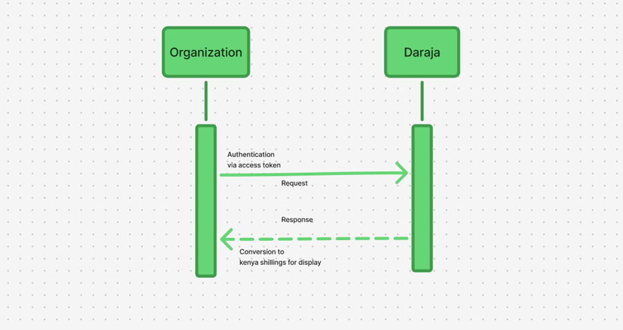

### Request Body

```json
{
  "points": "40"
}
```

### Request Parameter Definition

| Name | Description | Type | Sample Values |
| --- | --- | --- | --- |
| Points | Loyalty points accumulated by safaricom customer | Integer | 20 |

### Response Body

```json
{
  "header": {
    "requestRefId": "55b2b8bd-0be4-4430-b0dc-792efccdc690",
    "responseCode": 200,
    "responseMessage": "Success",
    "customerMessage": "Request executed successfully.",
    "timestamp": "2025-02-24T12:29:05.484864516"
  },
  "body": {
    "amount": "8",
    "points": "40",
    "rate": "0.2"
  }
}
```

### Response Parameter Definition

| Name | Description | Type | Sample Values |
| --- | --- | --- | --- |
| requestRefId | Unique ID associated with the request | String | 55b2b8bd-0be4-4430-b0dc-792efccdc690 |
| Response code | Response code returned after the overall process. | Integer | 404 |
| Response message | Message associated with the response code. | String | Fail |
| customerMessage | Customer message | String | Sorry, you are not registered on Bonga |
| timestamp | This is the Timestamp of the transaction, normally in the format of YEAR+MONTH+DATE+HOUR+MINUTE+SECOND (YYYYMMDDHHMMSS) Each part should be at least two digits apart from the year which takes four digits. | Timestamp | 2025-02-24T12:29:05.484864516 |
| amount | This is the amount to pay | Integer | 20 |
| points | This is the equivalent point to be deducted | Integer | 100 |
| rate | This is the bonga conversion rate to kenya shilling. The earned points are redeemable at a rate of Ksh.0.2 for every Bonga point. | Decimal | 0.2 |

### Redeem Points

Partners can redeem Bonga Points by integrating with the Redeem Points API. This endpoint allows customers to convert their accumulated Bonga Points into payment towards goods and services.

### Environments

| Environment | Description | URL |
| --- | --- | --- |
| Sandbox | Testing environment. | <https://sandbox.safaricom.co.ke/v1/lipa/na/bonga/redeem-paybill> |
| Production | Live environment for real transactions. | <https://api.safaricom.co.ke/v1/lipa/na/bonga/redeem-paybill> |

### Sequence Diagram

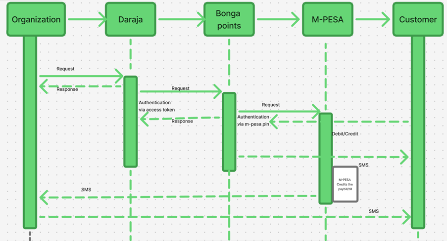

### Request Body

```json
{
  "msisdn": "254720776155",
  "amount": 50,
  "bongaPoints": 20,
  "conversionRate": 0.2,
  "shortCode": "888880",
  "accountNumber": "test"
}
```

### Request Parameter Definition

| Name | Description | Type | Sample Values |
| --- | --- | --- | --- |
| Username | Request header parameter for authenticating the service in Bonga Everywhere | String | Username |
| Password | Request header parameter for authenticating the service in Bonga Everywhere. Hashed with SHA256 | String | Password |
| Request id | Unique (timestamp) | Integer | Request id |
| MSISDN | Subscriber mobile number | Integer | 0722000000 |
| conversion\_rate | The earned points are redeemable at a rate of Ksh.0.2 for every Bonga point. | Decimal | 0.2 |
| Points | Points to be deducted | Integer | 20 |

### Response Body

```json
{
  "header": {
    "requestRefId": "a53a2939-7361-482f-ba1e-ccd51504acd3",
    "responseCode": 200,
    "responseMessage": "Operation Successfully.",
    "customerMessage": "Dear customer, your request was processed successfully",
    "timestamp": "2026-03-10T09:54:28.456847481"
  },
  "body": null
}
```

### Response Parameter Definition

| Name | Description | Type | Sample Values |
| --- | --- | --- | --- |
| requestRefId | Unique ID associated with the request | String | 55b2b8bd-0be4-4430-b0dc-792efccdc690 |
| Response code | Response code returned after the overall process. | Integer | 404 |
| Response message | Message associated with the response code. | String | Fail |
| customerMessage | Customer message | String | Sorry, you are not registered on Bonga |
| timestamp | This is the Timestamp of the transaction, normally in the format of YEAR+MONTH+DATE+HOUR+MINUTE+SECOND (YYYYMMDDHHMMSS) Each part should be at least two digits apart from the year which takes four digits. | Timestamp | 2025-02-24T12:29:05.484864516 |

## Result Codes

| ResponseCode | ResponseDescription |
| --- | --- |
| 6000 | Success |
| 6001 | Fail |
| 6004 | Server error |
| 6005 | Invalid credentials passed |
| 6006 | Missing parts in the request body |
| 6007 | CBS unavailable/ System busy - Email or SMS notification to respective support. |
| 6008 | STK unavailable/ System busy - Email or SMS notification to respective support. |
| 6009 | Broker unavailable/ System busy - Email or SMS notification to respective support. |
| 1037 | DS timeout (Customer doesn't have STK applet) - SMS notification (Inform customer to update SIM card) Message included in the messaging template |
| 6011 | Database unavailable - Email or SMS notification to respective support. |
| 2001 | Wrong PIN entered - Notification to customer/initiator information invalid |
| 1031 | STK push timeout the customer did not enter the PIN in time - Notification |
| 17 | Reversal fails, due to account balance limit i.e. 100,000 - Notification |

## Next steps

### Testing

***Testing time Devs***

### Option 1: Daraja Simulator

Create a new test app under apps on the main nerve bar, select lipa na bonga product. Once app is successfully created the simulator is automated to pick app credentials (Consumer key and Consumer Secret) and predefined test data, you can hit the simulate button.
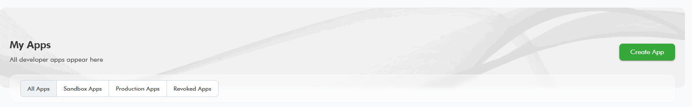

### Note: The simulator can only be accessed when logged in. Please [log in](https://developer.safaricom.co.ke/account/login) to your Daraja account to access the simulator.

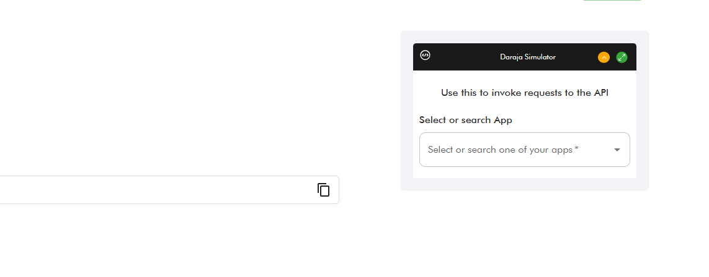

### Option 2: Postman

Use the credentials to generate access token using the below endpoint.

* Sandbox: <https://sandbox.safaricom.co.ke/oauth/v1/generate?grant_type=client_credentials>.
* Production: <https://api.safaricom.co.ke/oauth/v1/generate?grant_type=client_credentials>.
* Production: (see production details)
  Initiate a transaction using the request body above.

### Note: The Postman collection can only be accessed when logged in. Please [log in](https://developer.safaricom.co.ke/account/login) to your Daraja account to access the collection.

Click the button named "Use API" to access the Postman collection with pre-built requests for all APIs.


Download the Postman collection and replace parameters with your credentials.

### Go Live

**Time to launch, here Dev you need help from the business teams no more Rambo stunts behind the keyboard. Some collaboration will do; a handshake to the business team in the morning it is. Wait! You can act Rambo if you are both the Business and Dev**

We’ve already tested, and finished development now attach the integration to a live pay bill/till number. Navigate to GO LIVE tab. Fill in the below fields with live data. We require a short code of a live pay bill or till number, the organization name and an M-PESA admin/manager username to successfully go live. Kindly visit our how-to section for more information on m-pesa org portal access and user creation.

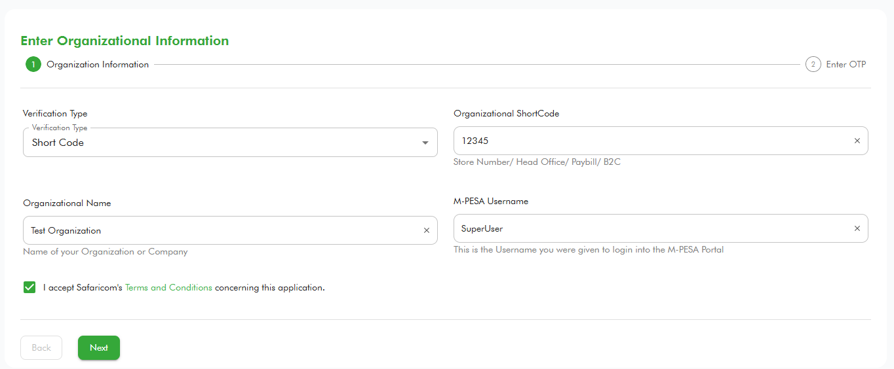

Upon successful go live, production endpoints will be sent to developer email and the test sandbox app will be moved to production with production consumer key and secrets. Below is how to see the production app.

**We’ve successfully deployed dev congratulations we are now live!**

## How To

**Access to the M-PESA Organization Portal and create Users**

The M-PESA organization portal is a platform designed for businesses and organizations to manage their financial transactions through the M-PESA services.

The portal offers various features for businesses, including:

1. Transaction Management: Monitor and manage transactions, generate reports, and reconcile accounts.
2. Account Management: Manage multiple user accounts with different access levels within the organization.
3. Bulk Payments: Facilitate bulk payments to employees, suppliers, and other beneficiaries efficiently.

**Access to the M-PESA Organization Portal**

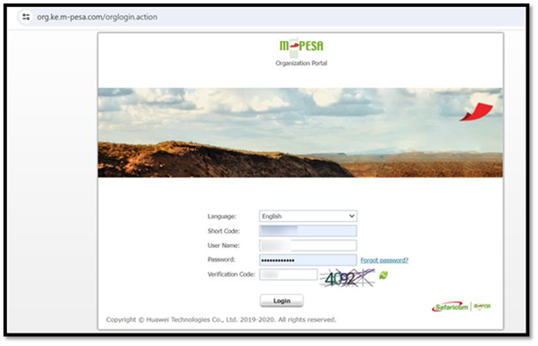

To access the Organization portal (<https://org.ke.m-pesa.com/orglogin.action>), you need to have a Business Administrator role created under your business short code (Pay Bill/ Till).

The first step before getting access, is to ensure the settlement option set to your short code is Bank via a Head Office application.

To make an application for a Head Office for your short code/Store Number, kindly contact [M-PESABusiness@Safaricom.co.ke](mailto:M-PESABusiness@Safaricom.co.ke) where they will provide you with the forms to be filled.

After Head Office is created, the [M-PESABusiness@Safaricom.co.ke](mailto:M-PESABusiness@Safaricom.co.ke) will also guide on the creation of the Business Administrator (username).

## How to login to M-PESA Organization Portal For the first time:

1. Launch the link from any of the browsers: <https://org.ke.m-pesa.com>.
2. Enter the Short code which is the Bulk payment number.
3. Enter the Business Administrator username received on email.
4. Enter the first-time password received on the same email. The Password is case-sensitive (full stop is not part of the password).
5. Enter the Verification Code displayed then click login, on the Next Page.
6. Enter OTP to proceed to the change password page.
7. Enter the first-time password on email, then proceed to set a new password.
8. Confirm password, security question, and security answer one and two which are mandatory.
9. The Password must meet the password rules as instructed.
10. Submit to successfully activate the Business Administrator account.
11. After activation, you will only be entering your username, shortcode, and password verification code and entering the OTP received via SMS to log in.

## Account Types in C2B Organization

1. **MMF/WORKING/M-PESA ACCOUNT FOR ORGANIZATION**

   * When an organization wants to make a business withdrawal, the funds are transferred to this account before the withdrawal request is made.
2. **UTILITY ACCOUNT**

   * Payments from customers are credited into the utility account.
3. **CHARGES PAID ACCOUNT**

   * For payments received from customers, depending on the tariff, a charge is levied on the Organization or is split between the organization and the customer. The charges paid account is debited and always accrues a negative balance which has to be settled before an organization can make a withdrawal request.
4. **ORGANIZATION SETTLEMENT ACCOUNT**

   * This account does the calculations for the organization operator when s/he initiates a revenue settlement. This account settles the charges paid account and then moves the balance from the Utility Account to the MMF account automatically. You will notice that the transaction type “Move funds from Utility to MMF” is no longer available as the revenue settlement process takes care of this.

## Various Roles under the portal

### Business Administrator role

The Business Administrator role is crucial for managing and overseeing user activities within the portal.

**Responsibilities of a Business Administrator:**

1. Create other system users and give them roles depending on what he/she wants them to do within the portal. The roles include:
   * A Business Web Operator who can initiate transactions, access statements, and check balance.
   * A business manager.
   * A Business Auditor – View Only/ Read Only Rights.
2. Not able to view transactions.
3. User created by Safaricom ([M-PESABusiness@Safaricom.co.ke](mailto:M-PESABusiness@Safaricom.co.ke)).

### Business Manager

The Business manager approves transactions, checks balances, and access statements.

**Responsibilities of a Business Manager:**

1. The user can View statements.
2. The user can initiate transactions.
3. The user can Approve/reject other transactions.
4. The user can withdraw funds from M-PESA.

**Proceed as below to create a business manager:**

1. Log in to the Organization portal as the Business administrator.
2. Select Operators.


3. Click the Add button.
4. You will be taken to a new page where you can enter the username of the operator.
5. Select Access Channel as Web.

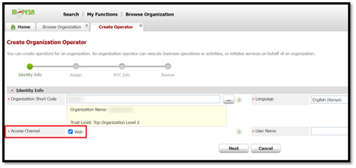

6. Select the Web Profile Default Rule Profile.
7. Assign the role as Business Manager and Set Restricted ORG API PASSWORD.

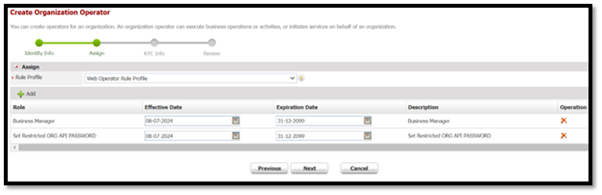

8. Enter the KYC information of the operator then submit.

### API user creation

**Proceed as below to create an API Operator:**

1. Log in as the Business administrator.
2. Select Operators.

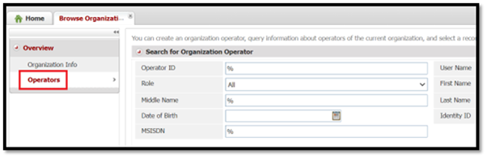

3. Click the Add button.
4. You will be taken to a new page where you can enter the username of the API initiator.
5. Select Access Channel as API.
6. Select the Web Profile Default Rule Profile.
7. Assign the appropriate role. Look for the ORG B2C API Initiator, Balance Query ORG API, and Transaction Status Query ORG API roles.

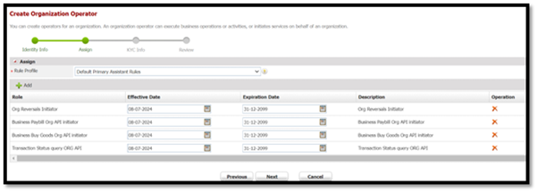

8. Enter the KYC information of the operator then submit.

**Here is how to set the password for the API user:**

1. Log in as a User with the Set Restrict Password Role (i.e., The Business Manager).

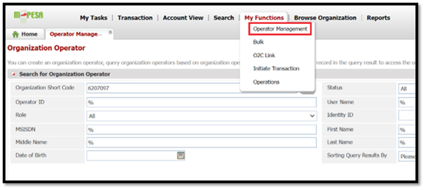

2. Click on My Functions, then select Operator Management.
3. Enter the API username to search. After it populates the API user, click on Operations.
4. Click on Set Password. Avoid using special characters such as @ or . when setting this password.

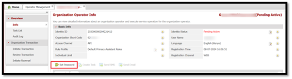

### Various API roles:

| API | API Role Assignment |
| --- | --- |
| B2C | ORG B2C API Initiator. |
| Business Pay Bill | Business Paybill Org API initiator. |
| Business Buy Goods | Business Buy Goods Org API initiator. |
| Transaction Status | Transaction Status query ORG API. |
| Reversals | Org Reversals Initiator. |
| Tax Remittance | Tax Remittance to KRA API. |
| Set Password role | Set Restricted ORG API PASSWORD. |

## How to apply for a live pay bill number/till number or B2C Account

For a live pay bill number/till number or B2C Account, contact: [M-PESABusiness@Safaricom.co.ke](mailto:M-PESABusiness@Safaricom.co.ke)

## Support

### Chatbot

Developers can get instant responses using the Daraja Chatbot for both development and production support.

### Production Issues & Incident Management

For production support and incident management:

* **Incident Management Page:** Visit the [Incident Management](https://developer.safaricom.co.ke/dashboard/incidentmanagement) page.
* **Email:** Reach out to API support at [apisupport@safaricom.co.ke](mailto:apisupport@safaricom.co.ke).

## Frequently Asked Questions (FAQs)

1. **Is this API open to all merchants who collect via Lipa na M-PESA Pay bill/Till number?**  
   Yes.
2. **How do I earn Bonga Points on the Safaricom network?**  
   You earn 1 Bonga Point for every Ksh 10 spent on Safaricom services such as calling, sending SMS, and using data.
3. **Do I earn Bonga Points when I use M-PESA?**  
   Yes, but only for M-PESA transaction charges of Ksh 100 or more. You earn 1 Bonga Point for every qualifying transaction.
4. **How can I access the Bonga Points service?**

   You can access the service through the following channels:

   * **For Safaricom customers enrolled in the loyalty program:**
     + Dial \*126#
     + Dial \*100# (for prepaid users)
     + Dial \*200# (for postpaid users)
     + Dial \*456#
     + Use the My Safaricom App
     + Chat with Zuri (Safaricom's virtual assistant)
   * **For M-PESA merchants who want to accept payment via Bonga Points:**
     + Integrate with the Lipa na Bonga API on the Daraja - Safaricom Developers' Portal.

Daraja 3.0

Daraja 3.0 is a web platform that offers access to Safaricom and M-PESA APIs that creates a bridge for payment integration to web and mobile apps. By connecting to our APIs, you open a world of possibilities to you and your clients. Together, we can transform lives.

Discover more

[Privacy Policy](/terms)

[Terms and Conditions](/terms)

Copyright@Safaricom PLC 2026

Ask Daraja about anything 😊


Logout of Daraja?

If you Logout, you will be required to Login again to access some features.

CancelLogout